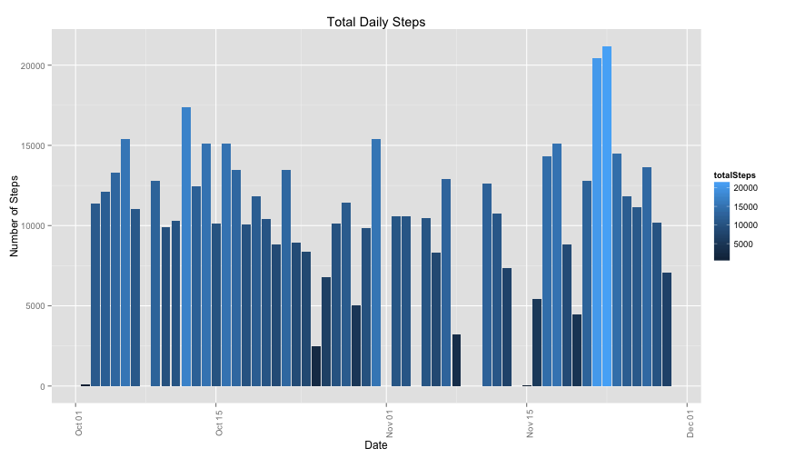

# Reproducible Research: Peer Assessment 1 #

## Introduction ##

It is now possible to collect a large amount of data about personal movement activity monitoring devices such as a [Fitbit](http://www.fitbit.com), [Nike Fuelband](http://www.nike.com/us/en_us/c/nikeplus-fuelband) or [Jawbone Up](http://jawbone.com/up). However, the data generated by these devises tend to remain under-utilised because the data is hard to obtain and/or there is a lack of statistical methods and software for processing and interpreting this data.

This assessment will use a small sampling of data from one such device to answer questions regarding the activity performed over a two month period.

## Data ##

The device collects data at 5 minute intervals throughout the day and consists of two months of data from an anonymous individual gathered during the months of October and November in 2012. The original data set is located at [https://d396qusza40orc.cloudfront.net/repdata%2Fdata%2Factivity.zip](https://d396qusza40orc.cloudfront.net/repdata%2Fdata%2Factivity.zip) as at the 17th October 2014, however, this analysis will used the file provided in the Github repo provided by Dr Peng and is named **activity.zip**. The extracted raw data file from this archive is a comma separated value file called **activity.csv** and consists of 3 variables and 17568 observations.

The columns in this raw data set are:

1. **steps**: The number of steps taken in a 5 minute period with missing data indicated with NA  
2. **date**: Dates of the recorded activity in "YYYY-MM-DD" format  
3. **interval**: Identifier for the 5 minute interval in which the measurement was taken  

## Goal of Analysis ##

The broad questions that this analysis will answer are:

1. What is the mean total number of steps taken each day?
2. What is the average daily activity pattern?
3. Inputting missing values
4. Are there differences in activity patterns between weekdays and weekends?

This analysis will answer each of these questions in order and provide a number of tables and plots,

## Analysis ##

This analysis assumes that the raw data file exists and that you have manually extracted it's contents into the current working directory.

### Loading and Preprocessing Data ###

Firstly lets load some needed libraries that will help manipulate the data


```r
library(plyr)
# No need to see the startup messages when loading dplyr
suppressPackageStartupMessages(library(dplyr))  
```

Then load the data and inspect the contents.


```r
activities <- tbl_df(read.csv('activity.csv'))

# Convert the 'date' column to a true date type
activities$date <- as.Date(activities$date)

activities
```

```
## Source: local data frame [17,568 x 3]
## 
##    steps       date interval
## 1     NA 2012-10-01        0
## 2     NA 2012-10-01        5
## 3     NA 2012-10-01       10
## 4     NA 2012-10-01       15
## 5     NA 2012-10-01       20
## 6     NA 2012-10-01       25
## 7     NA 2012-10-01       30
## 8     NA 2012-10-01       35
## 9     NA 2012-10-01       40
## 10    NA 2012-10-01       45
## ..   ...        ...      ...
```

```r
str(activities)
```

```
## Classes 'tbl_df', 'tbl' and 'data.frame':	17568 obs. of  3 variables:
##  $ steps   : int  NA NA NA NA NA NA NA NA NA NA ...
##  $ date    : Date, format: "2012-10-01" "2012-10-01" ...
##  $ interval: int  0 5 10 15 20 25 30 35 40 45 ...
```

Looks to be pretty tidy data aside from the NA values which will be addressed shortly. We can proceed to perform the analysis for the first set of questions.

### Q1 - What is the mean total number of steps taken per day? ###

The first step is to summarise the data into a new data-frame giving the total number of steps per day. As the missing values can be hard to determine (i.e. they may be zero or may be plenty) we need to remove them from the summary data frame. After summarising the data, let's inspect the new data frames values


```r
dailyStepsTally <- activities %>%
    filter(!is.na(steps)) %>%
    group_by(date) %>%
    summarise(totalSteps=sum(steps))

dailyStepsTally
```

```
## Source: local data frame [53 x 2]
## 
##          date totalSteps
## 1  2012-10-02        126
## 2  2012-10-03      11352
## 3  2012-10-04      12116
## 4  2012-10-05      13294
## 5  2012-10-06      15420
## 6  2012-10-07      11015
## 7  2012-10-09      12811
## 8  2012-10-10       9900
## 9  2012-10-11      10304
## 10 2012-10-12      17382
## 11 2012-10-13      12426
## 12 2012-10-14      15098
## 13 2012-10-15      10139
## 14 2012-10-16      15084
## 15 2012-10-17      13452
## 16 2012-10-18      10056
## 17 2012-10-19      11829
## 18 2012-10-20      10395
## 19 2012-10-21       8821
## 20 2012-10-22      13460
## 21 2012-10-23       8918
## 22 2012-10-24       8355
## 23 2012-10-25       2492
## 24 2012-10-26       6778
## 25 2012-10-27      10119
## 26 2012-10-28      11458
## 27 2012-10-29       5018
## 28 2012-10-30       9819
## 29 2012-10-31      15414
## 30 2012-11-02      10600
## 31 2012-11-03      10571
## 32 2012-11-05      10439
## 33 2012-11-06       8334
## 34 2012-11-07      12883
## 35 2012-11-08       3219
## 36 2012-11-11      12608
## 37 2012-11-12      10765
## 38 2012-11-13       7336
## 39 2012-11-15         41
## 40 2012-11-16       5441
## 41 2012-11-17      14339
## 42 2012-11-18      15110
## 43 2012-11-19       8841
## 44 2012-11-20       4472
## 45 2012-11-21      12787
## 46 2012-11-22      20427
## 47 2012-11-23      21194
## 48 2012-11-24      14478
## 49 2012-11-25      11834
## 50 2012-11-26      11162
## 51 2012-11-27      13646
## 52 2012-11-28      10183
## 53 2012-11-29       7047
```

Looks to be pretty valid information, so let's plot in out to gain a visual perspective of this data. The plotting system used is ggplot2 by Hadley Wickham.


```r
library(ggplot2)

ggplot(subset(dailyStepsTally, !is.na(totalSteps)), aes(date, totalSteps)) +
    geom_histogram(stat="identity", aes(fill=totalSteps)) +
    ggtitle("Total Daily Steps") +
    xlab("Date") +
    ylab("Number of Steps") +
    theme(axis.text.x=element_text(angle=90))
```

 

It would also be handy to know what †he mean and median values for the daily steps taken are:


```r
dailySteps.sum <- sum(dailyStepsTally$totalSteps)
dailySteps.mean <- format(mean(dailyStepsTally$totalSteps), digits = 9)
dailySteps.median <- median(dailyStepsTally$totalSteps)
```

| Sum | Mean | Median |
|----:|-----:|-------:|
| 570608 | 10766.1887 | 10765 |     

### Q2 - What is the average daily activity pattern? ###

The aggregate function is used on the original data frame to produce a new data frame with the average number of steps for each time interval over all days. We can examine what this results in by running the code


```r
activityMeans <- aggregate(steps ~ interval, data=activities, FUN=mean) 
activityMeans
```

```
##     interval     steps
## 1          0   1.71698
## 2          5   0.33962
## 3         10   0.13208
## 4         15   0.15094
## 5         20   0.07547
## 6         25   2.09434
## 7         30   0.52830
## 8         35   0.86792
## 9         40   0.00000
## 10        45   1.47170
## 11        50   0.30189
## 12        55   0.13208
## 13       100   0.32075
## 14       105   0.67925
## 15       110   0.15094
## 16       115   0.33962
## 17       120   0.00000
## 18       125   1.11321
## 19       130   1.83019
## 20       135   0.16981
## 21       140   0.16981
## 22       145   0.37736
## 23       150   0.26415
## 24       155   0.00000
## 25       200   0.00000
## 26       205   0.00000
## 27       210   1.13208
## 28       215   0.00000
## 29       220   0.00000
## 30       225   0.13208
## 31       230   0.00000
## 32       235   0.22642
## 33       240   0.00000
## 34       245   0.00000
## 35       250   1.54717
## 36       255   0.94340
## 37       300   0.00000
## 38       305   0.00000
## 39       310   0.00000
## 40       315   0.00000
## 41       320   0.20755
## 42       325   0.62264
## 43       330   1.62264
## 44       335   0.58491
## 45       340   0.49057
## 46       345   0.07547
## 47       350   0.00000
## 48       355   0.00000
## 49       400   1.18868
## 50       405   0.94340
## 51       410   2.56604
## 52       415   0.00000
## 53       420   0.33962
## 54       425   0.35849
## 55       430   4.11321
## 56       435   0.66038
## 57       440   3.49057
## 58       445   0.83019
## 59       450   3.11321
## 60       455   1.11321
## 61       500   0.00000
## 62       505   1.56604
## 63       510   3.00000
## 64       515   2.24528
## 65       520   3.32075
## 66       525   2.96226
## 67       530   2.09434
## 68       535   6.05660
## 69       540  16.01887
## 70       545  18.33962
## 71       550  39.45283
## 72       555  44.49057
## 73       600  31.49057
## 74       605  49.26415
## 75       610  53.77358
## 76       615  63.45283
## 77       620  49.96226
## 78       625  47.07547
## 79       630  52.15094
## 80       635  39.33962
## 81       640  44.01887
## 82       645  44.16981
## 83       650  37.35849
## 84       655  49.03774
## 85       700  43.81132
## 86       705  44.37736
## 87       710  50.50943
## 88       715  54.50943
## 89       720  49.92453
## 90       725  50.98113
## 91       730  55.67925
## 92       735  44.32075
## 93       740  52.26415
## 94       745  69.54717
## 95       750  57.84906
## 96       755  56.15094
## 97       800  73.37736
## 98       805  68.20755
## 99       810 129.43396
## 100      815 157.52830
## 101      820 171.15094
## 102      825 155.39623
## 103      830 177.30189
## 104      835 206.16981
## 105      840 195.92453
## 106      845 179.56604
## 107      850 183.39623
## 108      855 167.01887
## 109      900 143.45283
## 110      905 124.03774
## 111      910 109.11321
## 112      915 108.11321
## 113      920 103.71698
## 114      925  95.96226
## 115      930  66.20755
## 116      935  45.22642
## 117      940  24.79245
## 118      945  38.75472
## 119      950  34.98113
## 120      955  21.05660
## 121     1000  40.56604
## 122     1005  26.98113
## 123     1010  42.41509
## 124     1015  52.66038
## 125     1020  38.92453
## 126     1025  50.79245
## 127     1030  44.28302
## 128     1035  37.41509
## 129     1040  34.69811
## 130     1045  28.33962
## 131     1050  25.09434
## 132     1055  31.94340
## 133     1100  31.35849
## 134     1105  29.67925
## 135     1110  21.32075
## 136     1115  25.54717
## 137     1120  28.37736
## 138     1125  26.47170
## 139     1130  33.43396
## 140     1135  49.98113
## 141     1140  42.03774
## 142     1145  44.60377
## 143     1150  46.03774
## 144     1155  59.18868
## 145     1200  63.86792
## 146     1205  87.69811
## 147     1210  94.84906
## 148     1215  92.77358
## 149     1220  63.39623
## 150     1225  50.16981
## 151     1230  54.47170
## 152     1235  32.41509
## 153     1240  26.52830
## 154     1245  37.73585
## 155     1250  45.05660
## 156     1255  67.28302
## 157     1300  42.33962
## 158     1305  39.88679
## 159     1310  43.26415
## 160     1315  40.98113
## 161     1320  46.24528
## 162     1325  56.43396
## 163     1330  42.75472
## 164     1335  25.13208
## 165     1340  39.96226
## 166     1345  53.54717
## 167     1350  47.32075
## 168     1355  60.81132
## 169     1400  55.75472
## 170     1405  51.96226
## 171     1410  43.58491
## 172     1415  48.69811
## 173     1420  35.47170
## 174     1425  37.54717
## 175     1430  41.84906
## 176     1435  27.50943
## 177     1440  17.11321
## 178     1445  26.07547
## 179     1450  43.62264
## 180     1455  43.77358
## 181     1500  30.01887
## 182     1505  36.07547
## 183     1510  35.49057
## 184     1515  38.84906
## 185     1520  45.96226
## 186     1525  47.75472
## 187     1530  48.13208
## 188     1535  65.32075
## 189     1540  82.90566
## 190     1545  98.66038
## 191     1550 102.11321
## 192     1555  83.96226
## 193     1600  62.13208
## 194     1605  64.13208
## 195     1610  74.54717
## 196     1615  63.16981
## 197     1620  56.90566
## 198     1625  59.77358
## 199     1630  43.86792
## 200     1635  38.56604
## 201     1640  44.66038
## 202     1645  45.45283
## 203     1650  46.20755
## 204     1655  43.67925
## 205     1700  46.62264
## 206     1705  56.30189
## 207     1710  50.71698
## 208     1715  61.22642
## 209     1720  72.71698
## 210     1725  78.94340
## 211     1730  68.94340
## 212     1735  59.66038
## 213     1740  75.09434
## 214     1745  56.50943
## 215     1750  34.77358
## 216     1755  37.45283
## 217     1800  40.67925
## 218     1805  58.01887
## 219     1810  74.69811
## 220     1815  85.32075
## 221     1820  59.26415
## 222     1825  67.77358
## 223     1830  77.69811
## 224     1835  74.24528
## 225     1840  85.33962
## 226     1845  99.45283
## 227     1850  86.58491
## 228     1855  85.60377
## 229     1900  84.86792
## 230     1905  77.83019
## 231     1910  58.03774
## 232     1915  53.35849
## 233     1920  36.32075
## 234     1925  20.71698
## 235     1930  27.39623
## 236     1935  40.01887
## 237     1940  30.20755
## 238     1945  25.54717
## 239     1950  45.66038
## 240     1955  33.52830
## 241     2000  19.62264
## 242     2005  19.01887
## 243     2010  19.33962
## 244     2015  33.33962
## 245     2020  26.81132
## 246     2025  21.16981
## 247     2030  27.30189
## 248     2035  21.33962
## 249     2040  19.54717
## 250     2045  21.32075
## 251     2050  32.30189
## 252     2055  20.15094
## 253     2100  15.94340
## 254     2105  17.22642
## 255     2110  23.45283
## 256     2115  19.24528
## 257     2120  12.45283
## 258     2125   8.01887
## 259     2130  14.66038
## 260     2135  16.30189
## 261     2140   8.67925
## 262     2145   7.79245
## 263     2150   8.13208
## 264     2155   2.62264
## 265     2200   1.45283
## 266     2205   3.67925
## 267     2210   4.81132
## 268     2215   8.50943
## 269     2220   7.07547
## 270     2225   8.69811
## 271     2230   9.75472
## 272     2235   2.20755
## 273     2240   0.32075
## 274     2245   0.11321
## 275     2250   1.60377
## 276     2255   4.60377
## 277     2300   3.30189
## 278     2305   2.84906
## 279     2310   0.00000
## 280     2315   0.83019
## 281     2320   0.96226
## 282     2325   1.58491
## 283     2330   2.60377
## 284     2335   4.69811
## 285     2340   3.30189
## 286     2345   0.64151
## 287     2350   0.22642
## 288     2355   1.07547
```

The data-frame has 288 observations which equate to every 5 minute time period during a day. This data can then be plotted using ggplot to graphically show the average peaks and troughs of activity through the day.


```r
ggplot(activityMeans, aes(interval, steps)) +
    geom_line() +
    ggtitle("Average Steps over 5 Minute Time Intervals") + 
    xlab("time Intervals") + 
    ylab("Number of Steps")
```

 

This plot shows some rather interesting points. There is very little activity before 5.30am (due to the likelihood of being asleep) and again from around 9:30pm. The major activity averages out from 8:30am to 9:00am with a lesser spike around lunchtime as well as mid and late afternoon.

To find out when the actual time period has the greatest activity, we need to go back to the original data frame, eliminate the na values and sort it by interval. The last observation in the resulting set is the answer and can be achieve by running the following code:


```r
steps <- activities %>%
    filter(!is.na(steps)) %>%
    arrange(steps)

maxInterval <- steps$interval[nrow(steps)]
maxDate <- format(steps$date[nrow(steps)], '%B %d, %Y')
maxSteps <- steps$steps[nrow(steps)]
```

Giving us the answer that the interval **615** on **November 27, 2012** had the maximum number of steps, being **806**.

### Q3 - Inputting missing values ###

We need to check to see what missing values are contained in the original data. In the previous questions they have simply been eliminated from the analysis. This is one method to handle missing values but certainly not the only one. In this section we will discuss another method of dealing with these missing values, and what the ramifications of this method is.

Firstly we need to check the original data set and find out how many missing values need to be handled.


```r
table(is.na(activities$date))
```

```
## 
## FALSE 
## 17568
```

```r
table(is.na(activities$interval))
```

```
## 
## FALSE 
## 17568
```

```r
table(is.na(activities$steps))
```

```
## 
## FALSE  TRUE 
## 15264  2304
```

As expected there are no missing values for the date or the interval columns, leaving only the steps column to deal with. Lets replace these missing values with the median values (not ideal as discussed below). 

First create a new data-frame with the NA values replaced by the median steps.


```r
activities.complete <- activities %>%
    group_by(interval) %>%
    mutate(steps = ifelse(is.na(steps), 
                          median(steps, na.rm = T), 
                          steps))

table(is.na(activities.complete$steps))
```

```
## 
## FALSE 
## 17568
```

And let's plot this data to visualise the total steps again to compare it to the first figure in this assessment. 

Firstly we need to summarise the data...


```r
dailyStepsTally <- activities.complete %>%
    group_by(date) %>%
    summarise(totalSteps=sum(steps))

dailyStepsTally
```

```
## Source: local data frame [61 x 2]
## 
##          date totalSteps
## 1  2012-10-01       1141
## 2  2012-10-02        126
## 3  2012-10-03      11352
## 4  2012-10-04      12116
## 5  2012-10-05      13294
## 6  2012-10-06      15420
## 7  2012-10-07      11015
## 8  2012-10-08       1141
## 9  2012-10-09      12811
## 10 2012-10-10       9900
## 11 2012-10-11      10304
## 12 2012-10-12      17382
## 13 2012-10-13      12426
## 14 2012-10-14      15098
## 15 2012-10-15      10139
## 16 2012-10-16      15084
## 17 2012-10-17      13452
## 18 2012-10-18      10056
## 19 2012-10-19      11829
## 20 2012-10-20      10395
## 21 2012-10-21       8821
## 22 2012-10-22      13460
## 23 2012-10-23       8918
## 24 2012-10-24       8355
## 25 2012-10-25       2492
## 26 2012-10-26       6778
## 27 2012-10-27      10119
## 28 2012-10-28      11458
## 29 2012-10-29       5018
## 30 2012-10-30       9819
## 31 2012-10-31      15414
## 32 2012-11-01       1141
## 33 2012-11-02      10600
## 34 2012-11-03      10571
## 35 2012-11-04       1141
## 36 2012-11-05      10439
## 37 2012-11-06       8334
## 38 2012-11-07      12883
## 39 2012-11-08       3219
## 40 2012-11-09       1141
## 41 2012-11-10       1141
## 42 2012-11-11      12608
## 43 2012-11-12      10765
## 44 2012-11-13       7336
## 45 2012-11-14       1141
## 46 2012-11-15         41
## 47 2012-11-16       5441
## 48 2012-11-17      14339
## 49 2012-11-18      15110
## 50 2012-11-19       8841
## 51 2012-11-20       4472
## 52 2012-11-21      12787
## 53 2012-11-22      20427
## 54 2012-11-23      21194
## 55 2012-11-24      14478
## 56 2012-11-25      11834
## 57 2012-11-26      11162
## 58 2012-11-27      13646
## 59 2012-11-28      10183
## 60 2012-11-29       7047
## 61 2012-11-30       1141
```

... then plot it...


```r
ggplot(dailyStepsTally, aes(date, totalSteps)) +
    geom_histogram(stat="identity", aes(fill=totalSteps)) +
    ggtitle("Total Daily Steps") +
    xlab("Date") +
    ylab("Number of Steps") +
    theme(axis.text.x=element_text(angle=90))
```

 

... and finally calculate the mean and median of this new data set.


```r
dailySteps.sum <- sum(dailyStepsTally$totalSteps)
dailySteps.mean <- format(mean(dailyStepsTally$totalSteps), digits = 8)
dailySteps.median <- median(dailyStepsTally$totalSteps)
```

| Sum | Mean | Median |
|----:|-----:|-------:|
| 579736 | 9503.8689 | 10395 |     

#### Conclusion ####

Comparing the above plot to that produced for question 1 shows that while the pattern is similar, some of the missing days have been added to the plot. However, there are differences in the mean and mean values in this data set in that both figures are lower by 300-400 steps. This can be explained by adding in the extra data values (>2000) into the set which all tend to now have low step counts.

The analysis done in this assessment was to use the median values of the steps as a whole. While this technique tended not to skew the data significantly it is far from ideal. A better solution would have been to have used the median values for each corresponding time interval. My thought process on how to do this is shown in the included scratchpad code file, where I simply ran out of time before submission to debug why it was not working as expected. Not doubt reviewing it later will find my error.

Even so, this technique is still not ideal. In an ideal world we would need to do some further investigation to find out why there are NA values in the original data and then make a better decision on whether to exclude or include them with a transformation.

### Q4 - Are there differences in activity patterns between weekdays and weekends ###

In order to answer this question it is necessary to be able to identify which date is a weekday and which fall on a weekend. The easiest way to do this is to add a column to our data set identifying where each date falls.


```r
activities.complete <- activities.complete %>%
    mutate(dayType = ifelse(weekdays(date) == 'Saturday' | 
                            weekdays(date) == 'Sunday', 
                            'Weekend', 'Weekday'))

activities.complete$dayType <- as.factor(activities.complete$dayType)

activities.complete
```

```
## Source: local data frame [17,568 x 4]
## Groups: interval
## 
##    steps       date interval dayType
## 1      0 2012-10-01        0 Weekday
## 2      0 2012-10-01        5 Weekday
## 3      0 2012-10-01       10 Weekday
## 4      0 2012-10-01       15 Weekday
## 5      0 2012-10-01       20 Weekday
## 6      0 2012-10-01       25 Weekday
## 7      0 2012-10-01       30 Weekday
## 8      0 2012-10-01       35 Weekday
## 9      0 2012-10-01       40 Weekday
## 10     0 2012-10-01       45 Weekday
## ..   ...        ...      ...     ...
```

And then this needs to be tallied up so we have a dataset tabling the total steps for each time interval broken down by weekdays and weekends.


```r
stepsTally <- activities.complete %>%
    group_by(dayType, interval) %>%
    summarise(avgSteps = mean(steps))

stepsTally
```

```
## Source: local data frame [576 x 3]
## Groups: dayType
## 
##    dayType interval avgSteps
## 1  Weekday        0  2.02222
## 2  Weekday        5  0.40000
## 3  Weekday       10  0.15556
## 4  Weekday       15  0.17778
## 5  Weekday       20  0.08889
## 6  Weekday       25  1.31111
## 7  Weekday       30  0.62222
## 8  Weekday       35  1.02222
## 9  Weekday       40  0.00000
## 10 Weekday       45  1.60000
## ..     ...      ...      ...
```

Which will allow us to plot the weekday and weekend activity for comparison.


```r
ggplot(stepsTally, aes(interval, avgSteps)) +
    geom_line() +
    facet_grid( dayType ~ .) + 
    ggtitle("Average Steps over 5 Minute Time Intervals") + 
    xlab("time Intervals") + 
    ylab("Number of Steps")
```

 
